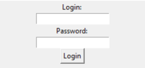
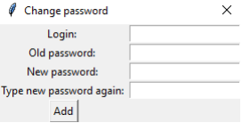
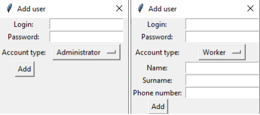
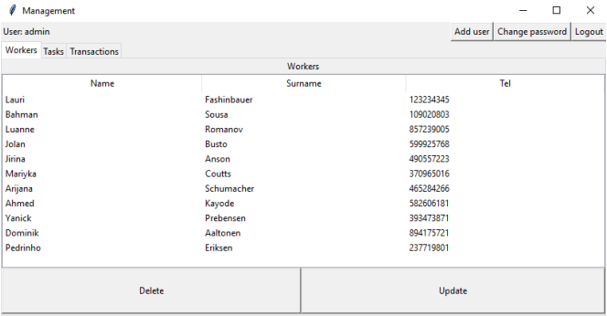
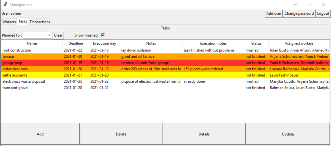
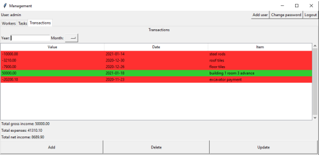
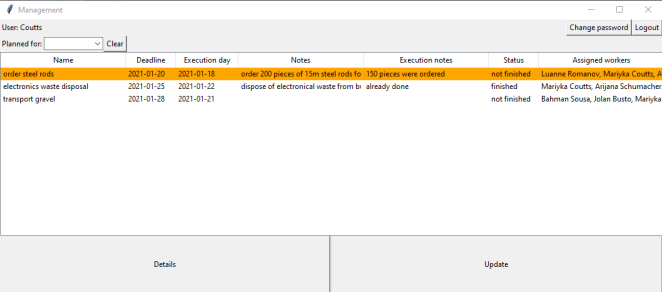
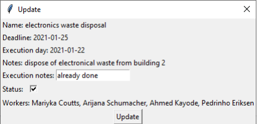

# Management Support App
## Introduction
This is a simple desktop application, which helps to manage a small company. It has been made as a university project for learning Python and Tkinter.
The app stores data about workers and allows to assign them tasks. It also stores data about company's transactions.

The system consists of a desktop app with a GUI written in Python and a MySQL database.
## Presentation
### User accounts
Every user has either an admin or a worker account, which they use to login to the system.

Each user can change their password.

### Admin view
Administrator has access to following functionalities:

Adding new users to the system.

Performing CRUD operations on workers data.

Performing CRUD operations on tasks data and assign workers to them.

Performing CRUD operations on transactions data.

### Worker view
A worker can see tasks that have been assigned to them and update theirs status and add notes to them.

